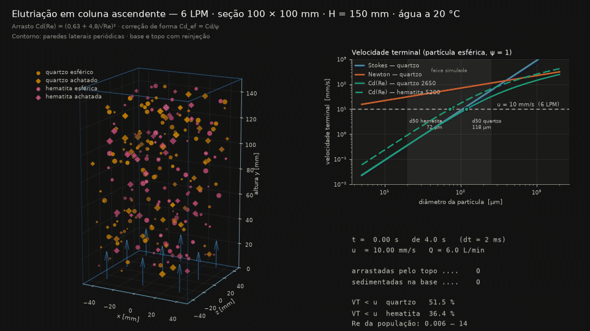

# Simulação 3D de elutriação em coluna ascendente (6 L/min)



## 1. Objetivo

Unificar em um único modelo tridimensional os três estudos desenvolvidos
separadamente — sedimentação no regime de Stokes, no regime de Newton e no
regime intermediário com fator de forma — e usá-lo para avaliar a separação
hidráulica (elutriação) de uma mistura quartzo/hematita em uma coluna com
fluxo ascendente de água de 6 L/min.

A dinâmica efetivamente integrada é a do regime intermediário, que é a única
válida em toda a faixa de Reynolds da população simulada; as leis de Stokes e
de Newton entram como curvas teóricas de referência no painel comparativo.

## 2. Modelo físico

### 2.1 Velocidade terminal

O equilíbrio entre peso aparente e arrasto fornece a velocidade terminal

$$v_t = \sqrt{\frac{4\,(\rho_p-\rho_f)\,g\,d}{3\,\rho_f\,C_{d}}}$$

com o coeficiente de arrasto dado pela correlação válida do regime laminar ao
turbulento:

$$C_d(Re) = \left(0{,}63 + \frac{4{,}8}{\sqrt{Re}}\right)^2,
\qquad Re = \frac{\rho_f\,v_t\,d}{\mu}$$

Como $C_d$ depende de $v_t$ através de $Re$, a equação é resolvida por
**iteração de ponto fixo** ($v_t \rightarrow Re \rightarrow C_d \rightarrow v_t$),
com tolerância de $10^{-12}$ m/s.

### 2.2 Fator de forma

A não esfericidade é introduzida por um fator de forma $\psi \in [0{,}4;\,1{,}0]$
($\psi = 1$ para partícula praticamente esférica), que penaliza o arrasto:

$$C_{d,\text{ef}} = \frac{C_d(Re)}{\psi}$$

O efeito é expressivo: para quartzo de 100 µm, $v_t$ cai de 7,55 mm/s
($\psi = 1$) para 3,24 mm/s ($\psi = 0{,}4$) — uma redução de 57 %. O mesmo
parâmetro controla a dispersão lateral da partícula, proporcional a
$(1-\psi)$: grãos irregulares oscilam mais no escoamento.

### 2.3 Leis de referência

| Regime | Expressão | Validade |
|---|---|---|
| Stokes | $v_t = \dfrac{(\rho_p-\rho_f)\,g\,d^2}{18\,\mu}$ | $Re < 1$ |
| Newton | $v_t = \sqrt{\dfrac{8}{3\,C_d}\,g\,\dfrac{\rho_p-\rho_f}{\rho_f}\,r}$, $C_d = 0{,}44$ | $10^3 < Re < 2\times10^5$ |
| Intermediário | $C_d(Re)$ acima, resolvido iterativamente | toda a faixa |

## 3. Condições de operação

| Parâmetro | Valor |
|---|---|
| Vazão imposta $Q$ | 6,0 L/min = 1,00 × 10⁻⁴ m³/s |
| Seção da coluna | 100 × 100 mm (A = 1,00 × 10⁻² m²) |
| Altura útil | 150 mm |
| Velocidade ascendente $u = Q/A$ | **10,0 mm/s** |
| Fluido | água a 20 °C ($\rho_f$ = 1000 kg/m³, $\mu$ = 1,0 × 10⁻³ Pa·s) |
| Sólidos | quartzo (2650 kg/m³) e hematita (5200 kg/m³) |
| Diâmetros | 20 a 250 µm (uniforme) |
| Fator de forma | 0,4 a 1,0 (uniforme) |
| Nº de partículas | 240 |
| Passo de tempo | 2 ms |
| Tempo simulado | 4,0 s (2000 passos, 126 quadros a 25 fps) |

O regime é diluído: as partículas não interagem entre si e não há correção de
sedimentação impedida (*hindered settling*).

## 4. Condições de contorno

As condições de contorno reproduzem as do modelo de referência (`b.py`):

- **Paredes laterais (x e z): periódicas.** A partícula que atravessa uma face
  lateral reentra pela face oposta. Isso elimina o efeito de parede e faz com
  que a caixa simulada represente um elemento representativo do interior da
  coluna, e não a coluna inteira com suas paredes.
- **Base (y < 0): sedimentação.** A partícula que atinge o fundo é contabilizada
  como sedimentada (produto grosso/pesado) e reinjetada no topo, em posição
  lateral aleatória, mantendo o número de partículas constante (alimentação
  contínua).
- **Topo (y > H): arraste.** A partícula que sai pelo topo é contabilizada como
  elutriada (produto fino/leve) e reinjetada na base, também de forma aleatória.

A velocidade resultante de cada partícula é
$v_y = u - v_t$, com $u$ uniforme na seção (escoamento pistão), mais um termo
lateral aleatório proporcional a $(1-\psi)$ que representa a dispersão
turbulenta de grãos irregulares.

## 5. Resultados

### 5.1 Velocidades terminais calculadas (partícula esférica)

| d [µm] | ρ_p [kg/m³] | Stokes [mm/s] | Newton [mm/s] | Cd(Re) [mm/s] | Re |
|---|---|---|---|---|---|
| 20 | 2650 | 0,36 | 31 | 0,37 | 0,007 |
| 20 | 5200 | 0,92 | 50 | 0,92 | 0,018 |
| 50 | 2650 | 2,25 | 50 | 2,15 | 0,108 |
| 50 | 5200 | 5,72 | 79 | 5,23 | 0,262 |
| 100 | 2650 | 8,99 | 70 | 7,55 | 0,755 |
| 100 | 5200 | 22,89 | 112 | 17,33 | 1,733 |
| 150 | 2650 | 20,23 | 86 | 14,75 | 2,213 |
| 150 | 5200 | 51,50 | 137 | 32,29 | 4,844 |
| 250 | 2650 | 56,20 | 111 | 31,32 | 7,829 |
| 250 | 5200 | 143,06 | 177 | 64,06 | 16,015 |

Abaixo de 50 µm ($Re \lesssim 0{,}3$) a solução iterativa coincide com Stokes
dentro de 5 %; a partir de 100 µm ($Re \sim 1$) Stokes já superestima a
velocidade terminal (20 % em 100 µm, 79 % em 250 µm), enquanto Newton
superestima grosseiramente em toda a faixa — o que confirma que somente a
formulação com $C_d(Re)$ é aplicável a esta granulometria.

### 5.2 Diâmetro de corte

O diâmetro de corte teórico é aquele em que $v_t = u = 10$ mm/s:

| Material | $d_{50}$ (ψ = 1) | $d_{50}$ (ψ = 0,4) |
|---|---|---|
| Quartzo (2650 kg/m³) | 118 µm | 193 µm |
| Hematita (5200 kg/m³) | 72 µm | 117 µm |

A razão entre os cortes dos dois minerais (≈ 1,6) é a própria **razão de
equisedimentação**: com 6 L/min, um grão de quartzo de 118 µm se comporta
hidraulicamente como um grão de hematita de 72 µm. É esse contraste que
permite a separação por densidade, e também o que limita a seletividade
quando a distribuição granulométrica é larga.

### 5.3 Balanço da simulação

Em 4,0 s de operação, partindo de uma população distribuída uniformemente na
coluna: **8 partículas arrastadas pelo topo** e **37 sedimentadas na base**.
Da população gerada, 51,5 % do quartzo e 36,4 % da hematita têm
$v_t < u$ e, portanto, tendem ao transbordo. O número de Reynolds das
partículas variou de 0,006 a 14, ou seja, a simulação atravessa a transição
laminar → intermediária, exatamente a região em que nem Stokes nem Newton são
individualmente adequados.

O fluxo líquido de saída pelo topo é menor que o de fundo porque a fração
grossa, embora minoritária em número, tem velocidade líquida descendente muito
maior (até −54 mm/s para hematita de 250 µm) e atravessa a coluna em poucos
segundos, enquanto os finos sobem lentamente (a 1–9 mm/s de velocidade
líquida).

## 6. Descrição da figura (GIF)

A animação mostra, à esquerda, a coluna em perspectiva 3D com rotação lenta da
câmera; as setas azuis na base indicam o fluxo ascendente de 6 L/min. A cor
identifica o mineral (laranja = quartzo, magenta = hematita), o marcador
identifica a forma (círculo = ψ ≥ 0,65; losango = ψ < 0,65, achatada) e o
tamanho do marcador é proporcional ao diâmetro real da partícula. À direita, o
painel superior traz as três leis de velocidade terminal em escala log-log,
com a linha tracejada da velocidade do fluido (10 mm/s) e os diâmetros de corte
marcados; o painel inferior acompanha, em tempo real, o tempo simulado e o
balanço de partículas arrastadas e sedimentadas.

## 7. Limitações

- Escoamento pistão: o perfil real de velocidade em coluna tem máximo no centro
  e é nulo na parede, o que alarga a distribuição de corte.
- Suspensão diluída: sem sedimentação impedida nem colisões entre partículas.
- A partícula é integrada diretamente na velocidade terminal, isto é, despreza-se
  o transiente de aceleração (justificável: para 100 µm o tempo de relaxação é
  da ordem de 10⁻³ s, muito menor que o passo de 2 ms).
- O fator de forma é um parâmetro empírico único, não uma esfericidade medida.

## 8. Reprodução

```bash
pip install numpy matplotlib pillow
python3 simulacao_elutriacao_3d.py
```

O script imprime no terminal a tabela de velocidades terminais e o balanço, e
grava o arquivo `elutriacao_3d.gif`. Vazão, geometria, granulometria e tempo
total são editáveis no bloco de constantes no topo do arquivo.
