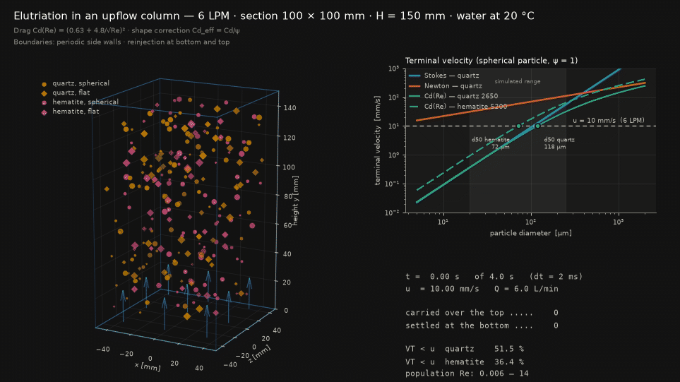

# 3D simulation of elutriation in an upflow column (6 L/min)



## 1. Objective

To merge into a single three-dimensional model the three studies developed
separately — settling in the Stokes regime, in the Newton regime and in the
intermediate regime with a shape factor — and use it to assess the hydraulic
separation (elutriation) of a quartz/hematite mixture in a column fed with an
upward water flow of 6 L/min.

The dynamics actually integrated are those of the intermediate regime, the
only formulation valid over the whole Reynolds range of the simulated
population; the Stokes and Newton laws appear as theoretical reference curves
in the comparison panel.

## 2. Physical model

### 2.1 Terminal velocity

The balance between apparent weight and drag gives the terminal velocity

$$v_t = \sqrt{\frac{4\,(\rho_p-\rho_f)\,g\,d}{3\,\rho_f\,C_{d}}}$$

with the drag coefficient given by the correlation that holds from the laminar
to the turbulent regime:

$$C_d(Re) = \left(0.63 + \frac{4.8}{\sqrt{Re}}\right)^2,
\qquad Re = \frac{\rho_f\,v_t\,d}{\mu}$$

Since $C_d$ depends on $v_t$ through $Re$, the equation is solved by
**fixed-point iteration** ($v_t \rightarrow Re \rightarrow C_d \rightarrow v_t$),
with a tolerance of $10^{-12}$ m/s.

### 2.2 Shape factor

Non-sphericity is introduced through a shape factor $\psi \in [0.4,\,1.0]$
($\psi = 1$ for a nearly spherical particle), which penalises the drag:

$$C_{d,\text{eff}} = \frac{C_d(Re)}{\psi}$$

The effect is substantial: for 100 µm quartz, $v_t$ drops from 7.55 mm/s
($\psi = 1$) to 3.24 mm/s ($\psi = 0.4$) — a 57 % reduction. The same
parameter controls the lateral dispersion of the particle, taken proportional
to $(1-\psi)$: irregular grains wander more in the flow.

### 2.3 Reference laws

| Regime | Expression | Validity |
|---|---|---|
| Stokes | $v_t = \dfrac{(\rho_p-\rho_f)\,g\,d^2}{18\,\mu}$ | $Re < 1$ |
| Newton | $v_t = \sqrt{\dfrac{8}{3\,C_d}\,g\,\dfrac{\rho_p-\rho_f}{\rho_f}\,r}$, $C_d = 0.44$ | $10^3 < Re < 2\times10^5$ |
| Intermediate | $C_d(Re)$ above, solved iteratively | whole range |

## 3. Operating conditions

| Parameter | Value |
|---|---|
| Imposed flow rate $Q$ | 6.0 L/min = 1.00 × 10⁻⁴ m³/s |
| Column section | 100 × 100 mm (A = 1.00 × 10⁻² m²) |
| Useful height | 150 mm |
| Upflow velocity $u = Q/A$ | **10.0 mm/s** |
| Fluid | water at 20 °C ($\rho_f$ = 1000 kg/m³, $\mu$ = 1.0 × 10⁻³ Pa·s) |
| Solids | quartz (2650 kg/m³) and hematite (5200 kg/m³) |
| Diameters | 20 to 250 µm (uniform) |
| Shape factor | 0.4 to 1.0 (uniform) |
| Number of particles | 240 |
| Time step | 2 ms |
| Simulated time | 4.0 s (2000 steps, 126 frames at 25 fps) |

The suspension is dilute: particles do not interact with one another and no
hindered-settling correction is applied.

## 4. Boundary conditions

The boundary conditions reproduce those of the reference model (`b.py`):

- **Side walls (x and z): periodic.** A particle crossing a lateral face
  re-enters through the opposite one. This removes the wall effect and makes
  the simulated box a representative element of the column interior rather than
  the whole column with its walls.
- **Bottom (y < 0): settling.** A particle reaching the bottom is counted as
  settled (coarse/heavy product) and reinjected at the top at a random lateral
  position, keeping the particle count constant (continuous feed).
- **Top (y > H): carry-over.** A particle leaving through the top is counted as
  elutriated (fine/light product) and likewise reinjected at the bottom.

The resulting particle velocity is $v_y = u - v_t$, with $u$ uniform over the
section (plug flow), plus a random lateral term proportional to $(1-\psi)$
representing the turbulent dispersion of irregular grains.

## 5. Results

### 5.1 Computed terminal velocities (spherical particle)

| d [µm] | ρ_p [kg/m³] | Stokes [mm/s] | Newton [mm/s] | Cd(Re) [mm/s] | Re |
|---|---|---|---|---|---|
| 20 | 2650 | 0.36 | 31 | 0.37 | 0.007 |
| 20 | 5200 | 0.92 | 50 | 0.92 | 0.018 |
| 50 | 2650 | 2.25 | 50 | 2.15 | 0.108 |
| 50 | 5200 | 5.72 | 79 | 5.23 | 0.262 |
| 100 | 2650 | 8.99 | 70 | 7.55 | 0.755 |
| 100 | 5200 | 22.89 | 112 | 17.33 | 1.733 |
| 150 | 2650 | 20.23 | 86 | 14.75 | 2.213 |
| 150 | 5200 | 51.50 | 137 | 32.29 | 4.844 |
| 250 | 2650 | 56.20 | 111 | 31.32 | 7.829 |
| 250 | 5200 | 143.06 | 177 | 64.06 | 16.015 |

Below 50 µm ($Re \lesssim 0.3$) the iterative solution agrees with Stokes to
within 5 %; from 100 µm on ($Re \sim 1$) Stokes already overestimates the
terminal velocity (by 20 % at 100 µm and 79 % at 250 µm), while Newton
overestimates it grossly over the entire range — confirming that only the
$C_d(Re)$ formulation is applicable to this size range.

### 5.2 Cut diameter

The theoretical cut diameter is the one at which $v_t = u = 10$ mm/s:

| Material | $d_{50}$ (ψ = 1) | $d_{50}$ (ψ = 0.4) |
|---|---|---|
| Quartz (2650 kg/m³) | 118 µm | 193 µm |
| Hematite (5200 kg/m³) | 72 µm | 117 µm |

The ratio between the two cut sizes (≈ 1.6) is the **equal-settling ratio**:
at 6 L/min a 118 µm quartz grain behaves hydraulically like a 72 µm hematite
grain. This contrast is what makes separation by density possible, and also
what limits selectivity when the size distribution is broad.

### 5.3 Simulation balance

Over 4.0 s of operation, starting from a population uniformly distributed
along the column: **8 particles carried over the top** and **37 settled at the
bottom**. Of the generated population, 51.5 % of the quartz and 36.4 % of the
hematite have $v_t < u$ and therefore tend to overflow. The particle Reynolds
number ranged from 0.006 to 14, so the simulation spans the laminar →
intermediate transition — precisely the region where neither Stokes nor Newton
is adequate on its own.

The net outflow through the top is smaller than the one through the bottom
because the coarse fraction, although a minority in number, has a much larger
net downward velocity (down to −54 mm/s for 250 µm hematite) and crosses the
column in a few seconds, whereas the fines rise slowly (at a net 1–9 mm/s).

## 6. Description of the figure (GIF)

The animation shows, on the left, the column in 3D perspective with a slow
camera rotation; the blue arrows at the bottom indicate the 6 L/min upflow.
Colour identifies the mineral (orange = quartz, magenta = hematite), the marker
identifies the shape (circle = ψ ≥ 0.65; diamond = ψ < 0.65, flat) and marker
size is proportional to the real particle diameter. On the right, the upper
panel shows the three terminal-velocity laws on log–log axes, with the dashed
line of the fluid velocity (10 mm/s) and the cut diameters marked; the lower
panel tracks, in real time, the simulated time and the balance of carried-over
and settled particles.

## 7. Limitations

- Plug flow: the real velocity profile in a column peaks at the centre and
  vanishes at the wall, which broadens the cut distribution.
- Dilute suspension: no hindered settling and no particle–particle collisions.
- The particle is integrated directly at its terminal velocity, i.e. the
  acceleration transient is neglected (justified: for 100 µm the relaxation
  time is of the order of 10⁻³ s, much shorter than the 2 ms step).
- The shape factor is a single empirical parameter, not a measured sphericity.

## 8. Reproduction

```bash
pip install numpy matplotlib pillow
python3 elutriation_3d_simulation.py
```

The script prints the terminal-velocity table and the balance to the terminal
and writes the file `elutriation_3d.gif`. Flow rate, geometry, size range and
total time can be edited in the constants block at the top of the file.
